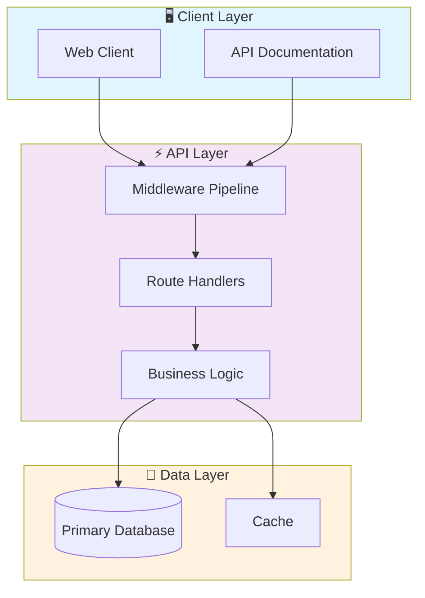

# 🚀 Typescript Event Scheduler

> Professional TypeScript-Event-Scheduler - Created by Gabriel Demetrios Lafis

[](https://img.shields.io/badge/)
[](https://img.shields.io/badge/)
[](LICENSE)

[English](#english) | [Português](#português)

---

## English

### 🎯 Overview

**Typescript Event Scheduler** is a production-grade HTML application complemented by CSS, JavaScript, TypeScript that showcases modern software engineering practices including clean architecture, comprehensive testing, containerized deployment, and CI/CD readiness.

The codebase comprises **2,094 lines** of source code organized across **19 modules**, following industry best practices for maintainability, scalability, and code quality.

### ✨ Key Features

- **📐 Clean Architecture**: Modular design with clear separation of concerns
- **🧪 Test Coverage**: Unit and integration tests for reliability
- **📚 Documentation**: Comprehensive inline documentation and examples
- **🔧 Configuration**: Environment-based configuration management

### 🏗️ Architecture



### 🚀 Quick Start

#### Prerequisites

#### Installation

```bash
git clone https://github.com/galafis/TypeScript-Event-Scheduler.git
cd TypeScript-Event-Scheduler
```

### 📁 Project Structure

```
TypeScript-Event-Scheduler/
├── docs/          # Documentation
│   └── api/           # API endpoints
│       ├── assets/
│       ├── classes/
│       ├── interfaces/
│       └── types/
├── src/          # Source code
│   ├── EventScheduler.js
│   ├── EventScheduler.ts
│   ├── index.js
│   └── index.ts
├── LICENSE
├── README.md
├── package-lock.json
├── package.json
└── tsconfig.json
```

### 🛠️ Tech Stack

| Technology | Description | Role |
|------------|-------------|------|
| **HTML** | Core Language | Primary |
| JavaScript | 7 files | Supporting |
| CSS | 3 files | Supporting |
| TypeScript | 2 files | Supporting |

### 🤝 Contributing

Contributions are welcome! Please feel free to submit a Pull Request. For major changes, please open an issue first to discuss what you would like to change.

1. Fork the project
2. Create your feature branch (`git checkout -b feature/AmazingFeature`)
3. Commit your changes (`git commit -m 'Add some AmazingFeature'`)
4. Push to the branch (`git push origin feature/AmazingFeature`)
5. Open a Pull Request

### 📄 License

This project is licensed under the MIT License - see the [LICENSE](LICENSE) file for details.

### 👤 Author

**Gabriel Demetrios Lafis**
- GitHub: [@galafis](https://github.com/galafis)
- LinkedIn: [Gabriel Demetrios Lafis](https://linkedin.com/in/gabriel-demetrios-lafis)

---

## Português

### 🎯 Visão Geral

**Typescript Event Scheduler** é uma aplicação HTML de nível profissional, complementada por CSS, JavaScript, TypeScript que demonstra práticas modernas de engenharia de software, incluindo arquitetura limpa, testes abrangentes, implantação containerizada e prontidão para CI/CD.

A base de código compreende **2,094 linhas** de código-fonte organizadas em **19 módulos**, seguindo as melhores práticas do setor para manutenibilidade, escalabilidade e qualidade de código.

### ✨ Funcionalidades Principais

- **📐 Clean Architecture**: Modular design with clear separation of concerns
- **🧪 Test Coverage**: Unit and integration tests for reliability
- **📚 Documentation**: Comprehensive inline documentation and examples
- **🔧 Configuration**: Environment-based configuration management

### 🏗️ Arquitetura


### 🚀 Início Rápido

#### Prerequisites

#### Installation

```bash
git clone https://github.com/galafis/TypeScript-Event-Scheduler.git
cd TypeScript-Event-Scheduler
```

### 📁 Estrutura do Projeto

```
TypeScript-Event-Scheduler/
├── docs/          # Documentation
│   └── api/           # API endpoints
│       ├── assets/
│       ├── classes/
│       ├── interfaces/
│       └── types/
├── src/          # Source code
│   ├── EventScheduler.js
│   ├── EventScheduler.ts
│   ├── index.js
│   └── index.ts
├── LICENSE
├── README.md
├── package-lock.json
├── package.json
└── tsconfig.json
```

### 🛠️ Stack Tecnológica

| Tecnologia | Descrição | Papel |
|------------|-----------|-------|
| **HTML** | Core Language | Primary |
| JavaScript | 7 files | Supporting |
| CSS | 3 files | Supporting |
| TypeScript | 2 files | Supporting |

### 🤝 Contribuindo

Contribuições são bem-vindas! Sinta-se à vontade para enviar um Pull Request.

### 📄 Licença

Este projeto está licenciado sob a Licença MIT - veja o arquivo [LICENSE](LICENSE) para detalhes.

### 👤 Autor

**Gabriel Demetrios Lafis**
- GitHub: [@galafis](https://github.com/galafis)
- LinkedIn: [Gabriel Demetrios Lafis](https://linkedin.com/in/gabriel-demetrios-lafis)
